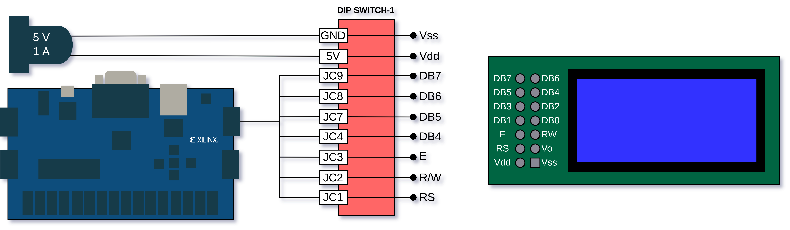

# LCD Ekran 8x2

Bu uygulamada önceden belirlenmiş ASCII karakterler _"FPGA ddApp-10"_ ekrana yazdırılır.

## Modülün Çalışma Prensibi

LCD ingilizcede **L**iquid **C**rystal **D**isplay kelimelerinin baş harflerinin bir araya getirilmesi ile oluşturulmuştur. LCD Ekran, büyük bir ekran kullanmanın gerek olmadığı, görece daha az bilginin kullanıcıya sunulması gerektiği durumlarda belirli spesifik değerlerin kullanıcıya aktarılması amacıyla kullanılan, insan ile makina arasındaki görsel arayüzdür.

Bu uygulamada kullanılan LCD modülü üzerinde sürücü olarak bir LSI entegre (__*ST7066*__) bulunmaktadır. Bu entegrenin 8 adet veri bacağı ve 3 adet kontrol bacağı vardır. 

| Pin No |  Pin Adı  | Pin Tanıtımı                                   |
| :----- | :-------: | :--------------------------------------------- |
| 1      |    Vss    | (Ground)                                       |
| 2      |    Vdd    | Güç Kaynağı (5 V)                              |
| 3      |    Vo     | Ekran'ın Kontrast Bacağı                       |
| 4      |    RS     | Veri / Komut alışverişi Modu Seçimi            |
| 5      |    R/W    | Okuma / Yazma Modu seçimi                      |
| 6      |     E     | Aktifleştirici Sinyal                          |
| 7-14   | DB7 - DB0 | Veri portları                                  |

Bu denetleyici entegrenin LCD ekrana yazı yazmak için özelleştirilmiş kendine has komutları komutları (Instruction) vardır. LCD ekran üzerinde bir işlem gerçekleştirmek istendiğinde, 3 kontrol bacağı ve 8 data bacağı üzerinden gerekli komutlar gönderilir. Sürücünün bütün komutları 8-Bit olduğundan dolayı bu 8 data bacağının hepsi kullanılarak komutların gönderilebileceği gibi, önce yüksek öncelikli daha sonra düşük öncelikli bitleri göndermek şartıyla 4 data bacağını kullanarak bu komutları göndermek de mümkündür.

> FPGA Uygulamaları Setinde PCB, FPGA kartı ile LCD'nin 4 Veri Bacağı ile arayüz oluşturacak şekilde çizilmiştir. Bu sebeple açıklamalar ve kod tamamıyla LCD ile 4-Bit arayüz yapacak şekilde yazılmıştır. LCD modül ile FPGA arasındaki arayüzü daha iyi anlamak için aşağıda **Bağlantılar** kısmındaki şemayı inceleyebilirsiniz. 

Projeniz için FPGA kartının veya bir mikrodenetleyicinin 8 bacağını bir LCD ekrana yazı yazmak için kullanmak kaynak israfı olabilir. Bu sebeple mikro-saniyeler mertebesinde bir süreden feragat ederek yalnızca 4 bacağı kullanarak LCD modül ile arayüz oluşturmayı tercih edebilirsiniz. Bu durumda göndereceğimiz komutlar 8-Bit olduğu için her komutu iki aşamada göndermemiz gerekiyor. Önce yüksek değerlikli 4 Bit (Upper 4 Bit), daha sonra düşük değerlikli 4 bit (Lower 4 Bit) gönderilir. Haberleşme için LCD'nin yüksek değerlikli 4 veri bacağı (DB7-DB4) kullanılır.

## Kodun Çalışma Prensibi

Bu uygulamada önceden belirlenmiş karakter dizisi olan "FPGA ddApp-10" ekrana yazdırmak için gerekli komutlar ve veriler 4-bit arayüz ile gönderilir. Bu amaçla 27 adımlı bir durum makinesi tasarlanmıştır. Bu durum makinesi ile gerekli gecikmeler sağlanır ve gerekli konfigürasyonlarla birlikte karakter verileri ekrana yazdırılır.

| Adım(lar) | RS | RW | E     | Gönderilen Veri (Hex) | Komut Adı                | Açıklama                                                                 |
|-----------|----|----|-------|-----------------------|--------------------------|-------------------------------------------------------------------------|
| 0         | -  | -  | -     | -                     | Başlangıç Gecikmesi      | 40 ms gecikme, LCD'nin açılması için bekleme süresi.                    |
| 1-2       | 0  | 0  | Pulse | 0x02                  | Fonksiyon Ayarı Başlat   | 4-bit moduna geçiş için ilk komut.                                      |
| 3-4       | 0  | 0  | Pulse | 0x2E                  | Fonksiyon Ayarı          | 4-bit mod, 2 satır, 5x10 nokta karakter fontu ayarlar.                  |
| 5-6       | 0  | 0  | Pulse | 0x08                  | Ekran Kapalı             | Ekranı, imleci ve yanıp sönmeyi kapatır.                                |
| 7-10      | 0  | 0  | Pulse | 0x0C                  | Ekran Açma               | Ekranı açar, imleci ve yanıp sönmeyi kapatır.                           |
| 11-14     | 0  | 0  | Pulse | 0x01                  | Ekranı Temizle           | Ekranı temizler ve imleci başlangıç pozisyonuna getirir.                |
| 15-18     | 0  | 0  | Pulse | 0x06                  | Giriş Modu Ayarı         | İmleci sağa hareket ettirir, ekran kaydırması yapmaz.                   |
| 19-22     | 1  | 0  | Pulse | Karakter Verisi       | Veri Yazma               | "FPGA ddApp-10" yazısını ekrana yazar.                                  |
| 23-26     | 0  | 0  | Pulse | 0xC0                  | DDRAM Adresi Ayarla      | İmleci ikinci satırın başlangıcına (adres 0x40) taşır.                  |
| 27        | -  | -  | -     | -                     | Döngü                    | Kalan karakterleri yazar veya işlem tamamlanır.                         |

## Bağlantılar

> Bu modül 5 V harici kaynak ile beslendiğinden harici güç adaptörünü takmayı unutmayınız! Aksi halde LCD modül çalışmayacaktır.
