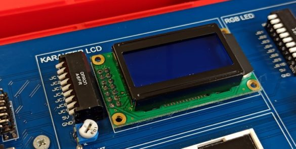
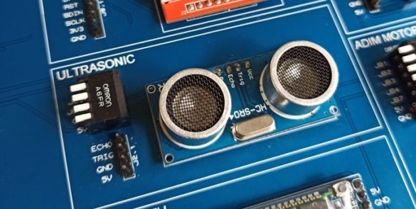

# Sayısal Tasarım ve FPGA Uygulamaları Seti

ddApp-10, temel Sayısal Tasarım konularına ilave olarak robotik nesnelerin interneti (IoT) konularının da FPGA üzerinde çeşitli projeler gerçekleştirilerek öğretilmesini hedefleyen sayısal tasarım uygulamaları setidir. Üzerinde Digilent firmasının Xilinx Artix-7 FPGA entegresini barındıran Basys3 kartını içerir.

Satın almak veya fiyat teklifi için ürün linki : [Beti Elektronik - Elektrovadi](https://www.elektrovadi.com/urun/ddapp-10)

### 8x2 Karakter LCD Ekran

LCD üzerinde ekranı sürmeye yarayan ekranı kontrol etmek için özelleştirilmiş kendine has komutları (instructionları) olan bir LSI (Large Scale Integration) sürücü entegresine Basys3 üzerinde hızlı saat sinyaline göre oldukça yavaş olan bu entegreye gerekli zaman gecikmeleri ile komutlar gönderilir. 

### Ultrasonik Sensör

Bir ses dalgası bir cisme çarpıp geri gelene kadarki süreyi tespit ederek ve sesin havadaki hızından bir çıkarım yaparak cisimlerin uzaklıklarını santimetre cinsinden Basys3 üzerinde bulunan 7 parçalı göstergede gösterir.

# ddApp-10 Github Repository

Bütün uygulamaların VHDL ve Verilog kaynak kodları ilgili klasörün altında bulunmaktadır. Aynı şekilde uygulamada kullanılan modülün çalışma prensipleri ve devre şemaları da burada yer alır.  

Bütün kaynak kodları Xilinx Vivado Design Suite 2019.2 versiyonunda test edilmiştir. Bütün HDL kodları ve constraints dosyaları doğrudan Vivado uygulamasına eklenerek kullanılabilir.
