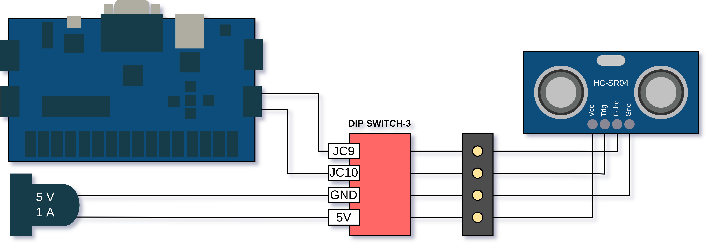

# Ultrasonik Sensör

## Uygulama

Bu uygulamanın amacı, ultrasonik mesafe sensörü (HC-SR04) kullanarak mesafe ölçmek; ölçülen değeri 7 segment display üzerinde göstermek ve bu değere göre kademeli olarak Basys3 geliştirme kartı üzerindeki ledleri yakmaktır.

## Kazanımlar

## Modülün Çalışma Prensibi

Deneyde kullanılan ultrasonik modül (HC-SR04) dört bacaklı bir mesafe sensörüdür. Bu modül, insanın duyabileceğinden daha yüksek frekansta bir ses dalgası gönderir. Bu ses dalgası yolda bir cisme çarparsa eğer ses dalgası yansır ve geri dönen ses dalgası modül tarafından tespit edilir. Ses dalgalarının havadaki hızını bildiğimiz için ses dalgası geri dönene kadar geçen süreyi kullanarak basit bir denklemle cismin uzaklığı tespit edilebilir.

$$ Mesafe = { (Ses \ Dalgası \ Gelene \ Kadar \ Geçen \ Süre) \ X  \ (Ses \ Hızı)\over 2} $$

Bu dört bacaklı mesafe sensörünün en baştaki ve en sondaki bacakları `Vcc` ve `Gnd` besleme bacaklarıdır. 5V'luk bir gerilimle çalıştığından Basys3 FPGA kartı üzerinden değil, uygulama setinin güç kaynağı ile beslenir. 

> Bu uygulama yapılırken, setin 5V beslemesinin takılı olduğundan emin olun.

Mesafe ölçümü yaparken bizim ilgilenmemiz gerekenler `Echo` ve `Trig` bacaklarıdır.

Modülün `Trig` bacağına en az 10 µs high sinyali verilir. Bu, modülü ses dalgası göndermesi için tetikleyen sinyaldir.

Modül ses dalgasını gönderme işlemini tamamladığında `Echo` bacağını high seviyesine çıkartır. Yansıyan ses dalgası modüle geri döndüğünde bu `Echo` bacağı tekrar low seviyesine düşer.

`Echo` bacağının high seviyesinde kalma süresi ses dalgasının modülden çıkıp tekrar geri gelene kadarki süreyi verir. Yapılması gereken bu süreyi tespit ederek mesafe ölçümünü sağlamaktır.

### Bağlantılar 

## Kodun Çalıştırılması

- Uygulama setinin güç adaptörünün takınız.
- Uygulama seti üzerindeki **_ULTRASONIC_** isimli modülün **_DIP SWITCH-3_** isimli anahtarın tümü açık hale getirilmelidir.
- Daha sonra projenin **_.bit_** uzantılı dosyasını FPGA kartına yazdırın. 