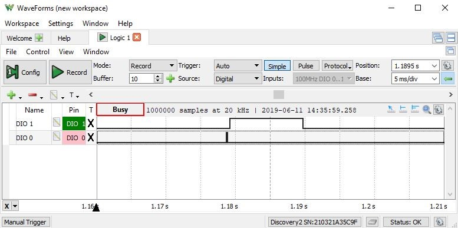

# Ultrasonik Sensör

Bu uygulamanın amacı, ultrasonik mesafe sensörü (HC-SR04) kullanarak mesafe ölçmek; ölçülen değeri 7 segment display üzerinde göstermek ve bu değere göre kademeli olarak Basys3 geliştirme kartı üzerindeki ledleri yakmaktır.

## Modülün Çalışma Prensibi

Deneyde kullanılan ultrasonik modül (HC-SR04) dört bacaklı bir mesafe sensörüdür. Bu modül, insanın duyabileceğinden daha yüksek frekansta bir ses dalgası gönderir. Bu ses dalgası yolda bir cisme çarparsa eğer ses dalgası yansır ve geri dönen ses dalgası modül tarafından tespit edilir. Ses dalgalarının havadaki hızını bildiğimiz için ses dalgası geri dönene kadar geçen süreyi kullanarak basit bir denklemle cismin uzaklığı tespit edilebilir.

Mesafe ölçümü yapılırken odaklanılması gereken `Echo` ve `Trig` pinleridir. Modülün `Trig` pinini dijital yüksek seviyesine çekmek, modülü ses dalgası göndermesi için tetikleyen sinyaldir. Modül, ses dalgasını gönderme işlemini tamamladığında `Echo` bacağını yüksek seviyesine çıkartır. Yansıyan ses dalgası modüle geri döndüğünde bu `Echo` bacağı tekrar dijital düşük seviyesine düşer.

`Echo` bacağının yüksek seviyesinde kalma süresi ses dalgasının modülden çıkıp tekrar geri gelene kadarki süreyi verir. Yapılması gereken aşağıdaki denklemde bu süreyi kullanarak mesafeyi hesaplamaktır. 

$$ Mesafe = { (Ses \ Dalgası \ Gelene \ Kadar \ Geçen \ Süre) \ X  \ (Ses \ Hızı)\over 2} $$

Bu dört bacaklı mesafe sensörünün en baştaki ve en sondaki bacakları `Vcc` ve `Gnd` besleme bacaklarıdır. 5V'luk bir gerilimle çalıştığından Basys3 FPGA kartı üzerinden değil, uygulama setinin güç kaynağı ile beslenir. 

> Bu uygulama yapılırken, setin 5V beslemesinin takılı olduğundan emin olun.

## Kodun Çalışma Prensibi

İlk adım olarak, modülün ses dalgası göndermesini sağlamak amacıyla Trig pinine en az 10 μs süreyle dijital bir yüksek sinyal uygulanır. Bu 10 μs süresi, sensörün [Üretici Dokümanında (Datasheet)](https://cdn.sparkfun.com/datasheets/Sensors/Proximity/HCSR04.pdf) Trig pinine uygulanması gereken minimum yüksek sinyal süresi olarak belirtilmiştir.

Ardı ardına sürekli ölçümler yapabilmek için Basys3 kartının 100 MHz temel frekansını bölerek 16.6667 Hz frekansında yeni bir saat sinyali elde edilmektedir. Bu değer, 60 ms bir periyoda karşılık gelmektedir. Bu periyot değeri tamamen keyfi seçilmiş olsa da seçim yaparken dikkat edilmesi gereken önemli bir nokta vardır. Sensörün ölçebileceği en yüksek mesafe 400 cm olarak belirtilmiştir.

$$
\frac{100 \, MHz}{6000000} = 16.6667 \, Hz \approx \frac{1}{60 \, ms}
\qquad
\frac{8 \, m \, (800cm)}{340 \, m/s \, (ses \, hızı)} \approx 23.53 \, ms
$$

Yeni tetikleme sinyali, bu **23.53 ms** değerinden daha kısa aralıklarla gönderilmemelidir. Aksi takdirde, henüz bir ölçüm tamamlanmadan yeni bir ölçüm başlatılır bu da ölçüm sonuçlarının doğruluğunu olumsuz etkiler. (Denklemde 400 m mesafeyi hesaplamak için ses dalgası gidiş ve geliş olmak üzere 800 m yol alacağı için denklemde o şekilde kullanılmıştır.)

Sonraki adımda, ultrasonik dalganın bir nesneye ulaşıp geri yansıması için geçen süreye karşılık gelen, Echo pininin yüksek kaldığı süre ölçülür. Bu süreye dayanarak mesafeyi hesaplamak için Echo pininin yüksek olduğu süre boyunca saat darbeleri sağılmıştır. Basys3 FPGA kartının saat frekansı 100 Mhz olduğundan (10ns) sayılan saat döngü sayısını geçen zamana ve dolayısıyla ses dalgasının kat ettiği mesafeye doğrudan ilişkilendirilebilir. 

Ölçülebilecek en ufak değişimi kısıtlayarak 1 cm diyelim. (Gidiş-Geliş olduğu için denklemde 2 cm olarak kullanılır) sesin bu mesafeyi kat etmesi için gereken süre ve bu süreyi elde etmek için gerekli saat darbe sayısı şu şekilde hesaplanır. 

$$
\frac{2 \, cm \times 1 \, cm}{34000 \, cm/s} \approx 58.8235 \, \mu s
\qquad
\frac{\approx 58.82 \, \mu s}{10 \, ns \, (Basys3 \, Saat \, Periyodu)} = \frac{58.82 \times 10^{-6} \, s}{10 \times 10^{-9} \, s} = 5882 \, \text{darbe}
$$

Sesin her 2 cm yol kat ettiğinde uzaklığa + 1 cm eklenmiştir. Çünkü d mesafesini ölçebilmek için ses 2d kadar yol alacaktır dolayısıyla 2d kadarlık bir yolu alırken geçen süre göz önünde bulundurulmalıdır. 

> Bu mantık şu şekilde VHDL koduna aktarılarak uzaklık verisi i_tmp değişkenine atanmıştır. 

Ancak elde edilen binary formatındaki mesafe değeri doğrudan 7 parçalı gösterge üzerinde gösterilemez. Çünkü verileri 7 parçalı gösterge üzerinde gösterebilmek için değerin onluk tabandaki basamaklara ayrılması gerekir. Örneğin, mesafe değeri *00100011* (ikilik sistemde) olsun; bu değer onluk sistemde *35* sayısına karşılık gelir. Bu durumda, 7 parçalı göstergelerin birinde *3*, diğerinde *5* gösterilmelidir. Dolayısıyla burada çözülmesi gereken problem, *00100011* sayısından bu basamakların nasıl elde edileceğidir.

Bu noktada devreye [BCD (Binary Coded Decimal)](https://en.wikipedia.org/wiki/Binary-coded_decimal), yani İkili Kodlu Ondalık yöntemi girer. Bu yöntem yöntemi her onluk basamağın dört bitlik ikili bir karşılığının olduğu bir kodlama sistemidir. Örneğin *35* sayısının BCD formatındaki gösterimi *0011 0101* olacaktır. Çünkü ilk 4 bit ikilik sistemde *3* değerine karşılık geliyorken son 4 bit ikilik sistemde *5* değerine karşılık gelmektedir. Bu nedenle BCD formatında ifade edilen değerler 7 parçalı göstergelerde gösterilebilecek ikili kodlardır denilebilir.

Binary olarak elde edilen ve i_tmp değişkeni içerisinde tutulan mesafe verisi [Double Dabble Algoritması](https://en.wikipedia.org/wiki/Double_dabble) kullanılarak BCD değere çevrilmiştir. 

Yukarıdaki görselde Trig bacağı yüksek seviyeye çekilerek ses dalgasının gönderildiği ve ses dalgası bir cisme çarpıp gelene kadar Echo pininin yüksek seviyesini koruduğu [Digilent WaveForms](https://digilent.com/reference/software/waveforms/waveforms-3/start?srsltid=AfmBOop_nxzSJkoRYtEvFg38hSNb2jKRSgCMRWUAdjtkmqXGpfuXZ-_S) arayüzünde [Analog Discovery 2](https://digilent.com/shop/analog-discovery-2-100ms-s-usb-oscilloscope-logic-analyzer-and-variable-power-supply/?srsltid=AfmBOoqU0xFMJj_oj6RW44gU6BHhybUUNaGA0Ki_hlSGw-6oPYG5ns39) kullanılarak yapılan ölçüm sonucu gözükmektedir

### Bağlantı Şeması 

## Kodun Çalıştırılması

1.	ddApp-10 Uygulama setinin üzerindeki ULTRASONIC isimli modülün DIP-SWITCH-3 isimli anahtarın tamamını aktif hale getiriniz ve bitstream doyasını Basys3 kartına yükleyiniz.
2.	BU UYGULAMA YAPILIRKEN, SETİN 5V BESLEMESİNİN TAKILI OLDUĞUNDAN EMİN OLUN.
3.	Deney setinde ultrasonik sensörün bulunduğu kısmın üzerine bir defter gibi yüze alanı büyük bir cisim ile yaklaşıp uzaklaşırsanız sensör ile defter arasındaki mesafenin santimetre cinsinden uzaklığını Basys3 kartı üzerinde 7 parçalı göstergede görebilirsiniz. 
